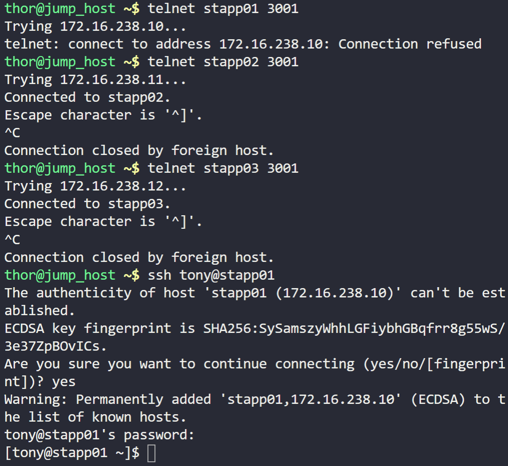

The production support team of xFusionCorp Industries has deployed some of the latest monitoring tools to keep an eye on every service, application, etc. running on the systems. One of the monitoring systems reported about Apache service unavailability on one of the app servers in Stratos DC.


Identify the faulty app host and fix the issue. Make sure Apache service is up and running on all app hosts. They might not hosted any code yet on these servers so you need not to worry about if Apache isn't serving any pages or not, just make sure service is up and running. Also, make sure Apache is running on port 3001 on all app servers.


To identify the faulty app host and fix the issue with Apache service, you can follow these steps:



1. Check the status of Apache service on all app hosts:
   ```shell
   systemctl status apache2
   ```

   This command will show the current status of the Apache service on each app host. Look for any hosts where the service is not running or is in a failed state.

2. Identify the faulty app host:
   Based on the output of the previous command, identify the app host where Apache service is not running or is in a failed state. This is the faulty app host that needs to be fixed.

3. Restart Apache service on the faulty app host:
   ```shell
   systemctl restart apache2
   ```

   This command will restart the Apache service on the faulty app host.

4. Verify the status of Apache service on all app hosts:
   ```shell
   systemctl status apache2
   ```

   Check the status of Apache service on all app hosts again. Ensure that the service is now running on the previously faulty app host and is in an active/running state.

  


5. Confirm Apache is running on port 3001:
   ```shell
   netstat -tuln | grep 3001
   ```

   Check the open network ports to verify that Apache is listening on port 3001 on all app hosts. The output should show the listening port as 3001 for the Apache service.

It appears that the Apache package is not available in the repositories or may not be installed on the server. Additionally, the Apache service may not be recognized by the systemctl command. 

To resolve this issue, follow these steps:

1. Install the Apache package:
   ```shell
   yum install httpd
   ```

   This command will install the Apache package on the server.

2. Start the Apache service:
   ```shell
   systemctl start httpd
   ```

   This command will start the Apache service.

3. Enable the Apache service to start automatically on system boot:
   ```shell
   systemctl enable httpd
   ```

   This command will configure the Apache service to start automatically when the server boots up.

4. Verify the status of the Apache service:
   ```shell
   systemctl status httpd
   ```

   Check the status of the Apache service to ensure that it is running and active.

After completing these steps, Apache should be up and running on the specified app host. Make sure to repeat these steps on all app hosts in the Stratos DC to ensure that Apache is running on all of them.

The status output indicates that the Apache service failed to start on the server. To investigate and resolve the issue, follow these steps:

1. Check the Apache error log:
   ```shell
   journalctl -xe -u httpd.service
   ```

   This command will display the Apache error log, which can provide insights into the cause of the failure.

2. Verify the Apache configuration:
   ```shell
   apachectl configtest
   ```

   This command will check the Apache configuration files for any syntax errors or misconfigurations.

3. Verify the port number configuration:
   Open the Apache configuration file `/etc/httpd/conf/httpd.conf` and ensure that the `Listen` directive is set to port 3001:
   ```
   Listen 3001
   ```

4. Resolve any errors or misconfigurations:
   Based on the information provided in the error log and configuration test, make the necessary adjustments to fix any errors or misconfigurations.

5. Restart the Apache service:
   ```shell
   systemctl restart httpd
   ```

   This command will attempt to restart the Apache service after making the required changes.

6. Check the status of the Apache service again:
   ```shell
   systemctl status httpd.service
   ```

   Verify if the service is running without any errors.

The output of the `apachectl configtest` command indicates that the Apache configuration syntax is correct. However, there is a warning message about the server's fully qualified domain name (FQDN) not being determined.

To resolve this warning, you can set the `ServerName` directive in the Apache configuration file. Follow these steps:

1. Open the Apache configuration file `/etc/httpd/conf/httpd.conf` using a text editor.

2. Search for the `ServerName` directive. It may be commented out (preceded by a `#` symbol). If it exists, remove the `#` symbol and set the appropriate FQDN for your server. If it doesn't exist, add the following line:
   ```
   ServerName stapp01.stratos.xfusioncorp.com
   ```

   Replace `stapp01.stratos.xfusioncorp.com` with the actual FQDN of your server.

3. Save the changes to the configuration file and exit the text editor.

4. Run the `apachectl configtest` command again to verify the syntax:
   ```shell
   apachectl configtest
   ```

   You should see the "Syntax OK" message without the warning about the server's FQDN.

5. Restart the Apache service:
   ```shell
   systemctl restart httpd
   ```

   This command will restart the Apache service with the updated configuration.

After completing these steps, you can check the status of the Apache service again using `systemctl status httpd.service` to ensure that it is running without any errors.

To check for a process ID (PID) using a specific port, you can use the `lsof` command along with the port number. Here's how you can do it:

1. Open a terminal or command prompt.
if lsof isnt installed in the system, run this command

 ```
   yum install lsof -y
   ```

2. Run the following command to check for the PID using port 3001:
   ```
   lsof -i :3001
   ```

   This command will display information about the process (if any) that is currently using the specified port.

3. Look for the "PID" column in the output. It will contain the process ID associated with the port 3001.

If there is a process running on port 3001, the `lsof` command will provide information about that process, including its PID. If the port is not in use, the command will not return any output.

Note: In some systems, you may need to run the `lsof` command with administrative privileges (e.g., using `sudo`) to view information about processes owned by other users.

4. if you can identify the PID, run the folowing code replacing PID with the correct PID number
```
   kill <PID>
```
this should work.

